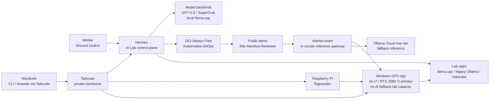

# Homelab

Living documentation of my homelab: AI control planes, GitOps infrastructure, private networking, and local GPU compute. The setup is kept cost-conscious where possible, using free tiers, self-hosting, and owned hardware instead of paid services when reliability or control matters.

## Snapshot

Hermes is the primary AI Lab control plane for Discord-first operation, scheduled work, Kanban-style coordination, and local tooling access. OpenClaw has been retired from the active path after repeated upgrade fragility, while the lab keeps multiple model backends available: GPT-5.5 as the default frontier path, SuperGrok / xAI OAuth as the second frontier path, and local `llama.cpp` for private GPU experiments.

Tailscale is the private backbone. Full lab operation happens from a MacBook over Tailscale, while mobile access stays Discord-first for talking to the agents. This keeps deep administration on a proper workstation while still making the agent layer reachable while traveling.

OCI Always Free runs the Kubernetes/GitOps side, including the public Kubernetes Manifest Reviewer demo and the internal `ollama-router` gateway it uses. Local hardware fills the gaps cloud delegates do not: the Windows-rebuilt `rtx-i7` / RTX 2080 Ti rig is the primary local inference path and is being moved from Ollama-first hosting toward CUDA-backed `llama.cpp` for larger GGUF models, `rtx-i5` remains fallback lab capacity, and Rigwarden handles wake/status control from a Raspberry Pi. Ollama Cloud free tier is kept as an inference fallback for the public demo rather than the primary path.

## Operating Model

## What Runs Here

**Agent control**

- **Hermes** — primary Discord-connected AI Lab control plane, using Kanban coordination, cron jobs, and direct local tooling access.
- **Hermes proxy** — OpenAI-compatible local endpoint for subscription-backed model access, including the SuperGrok / xAI OAuth path.
- **OpenClaw** — legacy/cold-standby agent surface rather than the active operating path.

**Infrastructure**

- **OCI Always Free Kubernetes** — GitOps workload target managed from [`../k8s-oci-cluster/`](../k8s-oci-cluster/), currently running `ollama-router` and the public Kubernetes Manifest Reviewer demo.
- **HP Docker host** — dedicated home node for AI agents, automation, and support services.
- **Tailscale** — private network backbone for remote operation without exposing internal services publicly.

**Local compute**

- **rtx-i7** — primary private GPU inference rig with RTX 2080 Ti, rebuilt as a Windows 11 + Docker Desktop GPU host.
- **rtx-i5** — fallback private GPU inference rig with GTX 1080, also rebuilt as a Windows 11 + Docker Desktop GPU host.
- **Local `llama.cpp` / legacy Ollama** — self-hosted model runtime on the GPU rigs. The RTX 2080 Ti path is being shifted to CUDA `llama.cpp` for larger GGUF models such as Qwen3.6-35B-A3B with partial GPU offload, while Ollama remains useful for smaller/demo models and compatibility until the router path is fully migrated.

## Lab Apps

- **Kubernetes Manifest Reviewer** runs publicly on the OCI cluster at <https://k8s-manifest-reviewer.maslanka.io>. It reviews small Kubernetes manifests with `ministral-3:8b` and routes inference through the in-cluster `ollama-router` to local RTX 2080 Ti inference, with Ollama Cloud free-tier fallback. The local backend is being migrated from Ollama-only serving toward `llama.cpp` for larger GGUF workloads. GitOps manifests live in [`../k8s-oci-cluster/apps/k8s-manifest-reviewer/`](../k8s-oci-cluster/apps/k8s-manifest-reviewer/).
- **ollama-router** runs internally in the OCI cluster as the OpenAI-compatible inference gateway for cluster apps. It has no public ingress; apps call it through Kubernetes service DNS. Today it still carries the historical Ollama name, but the homelab direction is to use it as a generic local-inference gateway that can front both Ollama-compatible smaller models and `llama.cpp`-served larger GGUF models. GitOps manifests live in [`../k8s-oci-cluster/apps/ollama-router/`](../k8s-oci-cluster/apps/ollama-router/), while the reusable app code lives in [`maslankalm/ollama-router`](https://github.com/maslankalm/ollama-router).
- **Rigwarden** runs on the Raspberry Pi controller and provides GPU rig wake/status control: UI for the operator, API for agents. 
  

- **Vidscribe** turns video sources into reusable transcript artifacts with local sound-to-text fallback.
- **Hermes proxy** exposes subscription-backed frontier models to local tools through an OpenAI-compatible `/v1` API.

## Changelog

Every homelab change across the cluster, local hardware, networking, and AI control plane is logged in [`CHANGELOG.md`](CHANGELOG.md).
